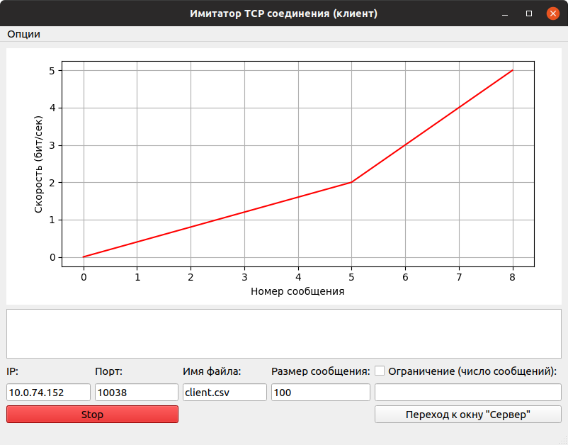
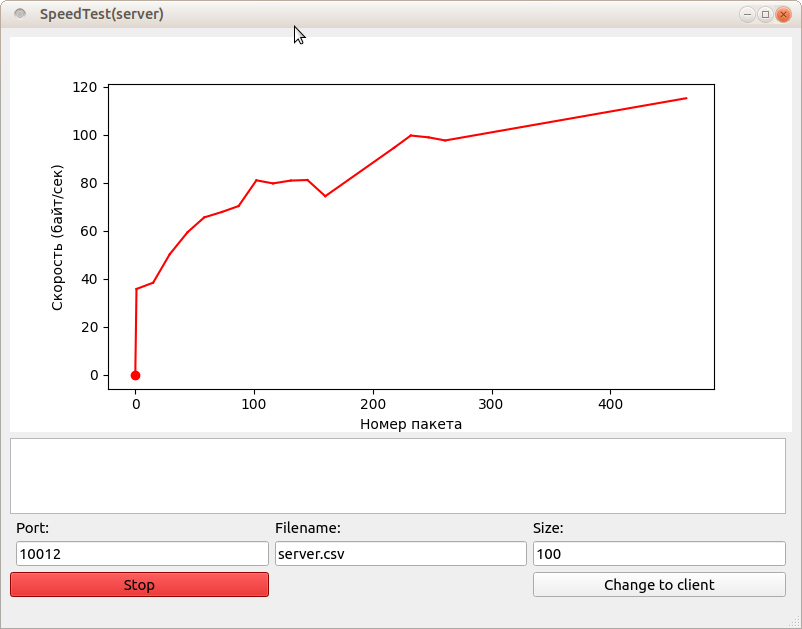

# TCP channel bandwidth meter
The program allows you to measure the bandwidth of the TCP channel. Also added the ability to run the UPD test with a manual speed limit to check the received values.
Program writes the results(package number, speed and delta) to a file and provides the ability to select packets size.

__Client inter interface:__

__Server inter interface:__

