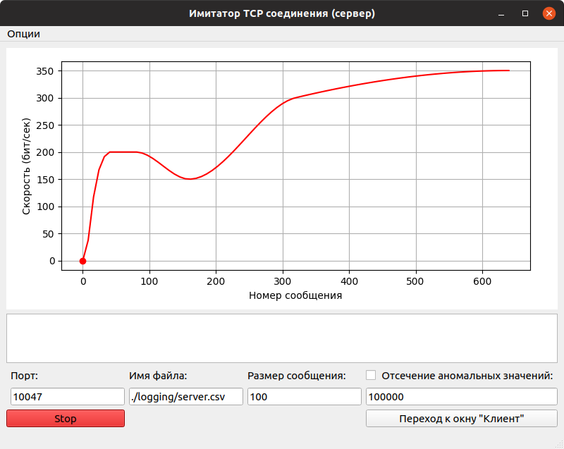

# TCP speed test
TCP speed meter on python with a simple PyQt5 interface. 
Program writes the results to a file(Filename field) and provides the ability to select packets size(Size field).

__Client inter interface:__

__Server inter interface:__

*Additional libraries required, more details in [requirements.txt](/requirements.txt).
